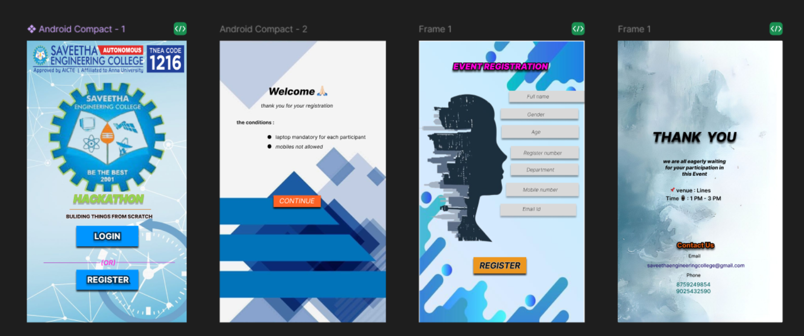

# Ex09 Event Registration Web Application
## Date:21/05/2025

## AIM:
To design, develop and deploy a web application for event registration.

## DESIGN STEPS:

### Step 1:
Create a new frame.

### Step 2:
Select any one preset size of your choice.

### Step 3:
Select the shapes you need.

### Step 4:
Import images as needed.

### Step 5:
Create pages based on your need and link them.

### Step 6:

Validate the HTML and CSS code.

### Step 6:

Publish the website in the given URL.

## DESIGN TOOL:
Figma

## CODE:
```
home page


<div style="width: 381px; height: 674px; position: relative; background: white">
  
  <div style="width: 148px; height: 49px; left: 118px; top: 443px; position: absolute; background: #0095FF; box-shadow: 0px 4px 4px rgba(0, 0, 0, 0.80)"></div>
  <div style="width: 245px; height: 41px; left: 72px; top: 357px; position: absolute; text-align: center; color: #90D656; font-size: 25px; font-family: Inter; font-style: italic; font-weight: 900; word-wrap: break-word">HACKATHON</div>
  <div style="width: 241px; height: 21px; left: 76px; top: 410px; position: absolute; text-align: center; color: #1E1E1E; font-size: 12px; font-family: Inter; font-weight: 800; word-wrap: break-word">BULIDING THINGS FROM SCRATCH</div>
  <div style="width: 194px; height: 0px; left: 102px; top: 404px; position: absolute; border: 1px #D97013 solid"></div>
  <div style="width: 148px; height: 30px; left: 118px; top: 453px; position: absolute; text-align: center; color: white; font-size: 20px; font-family: Inter; font-weight: 800; word-wrap: break-word">LOGIN</div>
  <div style="width: 140px; height: 0px; left: 213px; top: 531px; position: absolute; border: 1px #C820CB solid"></div>
  <div style="width: 38px; height: 22px; left: 175px; top: 520px; position: absolute; text-align: center; color: #FD26D9; font-size: 16px; font-family: Inter; font-style: italic; font-weight: 600; word-wrap: break-word">(OR)</div>
  <div style="width: 135px; height: 0px; left: 175px; top: 531px; position: absolute; transform: rotate(180deg); transform-origin: 0 0; border: 1px #AA21BC solid"></div>
  <div style="width: 148px; height: 48px; left: 118px; top: 548px; position: absolute; background: #0095FF; box-shadow: 0px 4px 4px rgba(0, 0, 0, 0.80)"></div>
  <div style="width: 145px; left: 121px; top: 560px; position: absolute; text-align: center; color: white; font-size: 20px; font-family: Inter; font-weight: 800; word-wrap: break-word">REGISTER</div>
</div>

CSS
/* Android Compact - 1 */

position: relative;
width: 381px;
height: 674px;

background: #FFFFFF;


/* Business Blue Technology Internet Big Data Data Background Wallpaper Image For Free Download - Pngtree 1 */

position: absolute;
width: 396px;
height: 694px;
left: -6px;
top: 0px;

background: url(download-removebg-preview.png), url(logo.png), url(Time Clock Business Announcement Background Wallpaper Image For Free Download - Pngtree.jpg);
backdrop-filter: blur(2px);
/* Note: backdrop-filter has minimal browser support */


/* Rectangle 1 */

position: absolute;
width: 148px;
height: 49px;
left: 118px;
top: 443px;

background: #0095FF;
box-shadow: 0px 4px 4px rgba(0, 0, 0, 0.8);


/* HACKATHON */

position: absolute;
width: 245px;
height: 41px;
left: 72px;
top: 357px;

font-family: 'Inter';
font-style: italic;
font-weight: 900;
font-size: 25px;
line-height: 30px;
display: flex;
align-items: center;
text-align: center;

color: #90D656;

border: 1px solid #ADAF3A;
text-shadow: 0px 4px 1px rgba(0, 0, 0, 0.25);


/* BULIDING THINGS FROM SCRATCH */

position: absolute;
width: 241px;
height: 21px;
left: 76px;
top: 410px;

font-family: 'Inter';
font-style: normal;
font-weight: 800;
font-size: 12px;
line-height: 15px;
display: flex;
align-items: center;
text-align: center;

color: #1E1E1E;

border: 1px solid #FEE9E7;


/* Line 1 */

position: absolute;
width: 194px;
height: 0px;
left: 102px;
top: 404px;

border: 1px solid #D97013;


/* LOGIN */

position: absolute;
width: 148px;
height: 30px;
left: 118px;
top: 453px;

font-family: 'Inter';
font-style: normal;
font-weight: 800;
font-size: 20px;
line-height: 24px;
display: flex;
align-items: center;
text-align: center;

color: #FFFFFF;

border: 3px solid rgba(0, 0, 0, 0.7);
text-shadow: 0px 4px 4px rgba(0, 0, 0, 0.25);


/* Line 3 */

position: absolute;
width: 140px;
height: 0px;
left: 213px;
top: 531px;

border: 1px solid #C820CB;


/* (OR) */

position: absolute;
width: 38px;
height: 22px;
left: 175px;
top: 520px;

font-family: 'Inter';
font-style: italic;
font-weight: 600;
font-size: 16px;
line-height: 19px;
display: flex;
align-items: center;
text-align: center;

color: #FD26D9;


/* Line 4 */

position: absolute;
width: 135px;
height: 0px;
left: 175px;
top: 531px;

border: 1px solid #AA21BC;
transform: rotate(180deg);


/* Rectangle 2 */

position: absolute;
width: 148px;
height: 48px;
left: 118px;
top: 548px;

background: #0095FF;
box-shadow: 0px 4px 4px rgba(0, 0, 0, 0.8);


/* REGISTER */

position: absolute;
width: 145px;
height: 24px;
left: 121px;
top: 560px;

font-family: 'Inter';
font-style: normal;
font-weight: 800;
font-size: 20px;
line-height: 24px;
display: flex;
align-items: center;
text-align: center;

color: #FFFFFF;

border: 3px solid rgba(0, 0, 0, 0.7);
text-shadow: 0px 4px 4px rgba(0, 0, 0, 0.25);

welcome page


<div style="width: 396px; height: 674px; position: relative; background: white">
  
  <div style="left: 98px; top: 148px; position: absolute; text-align: center; color: black; font-size: 12px; font-family: Inter; font-style: italic; font-weight: 400; word-wrap: break-word">thank you for your registration</div>
  <div style="left: 133px; top: 223px; position: absolute; text-align: center; color: black; font-size: 12px; font-family: Inter; font-weight: 400; word-wrap: break-word">laptop mandatory for each participant</div>
  <div style="width: 160px; height: 33px; left: 106px; top: 105px; position: absolute; text-align: center; color: black; font-size: 24px; font-family: Inter; font-style: italic; font-weight: 800; word-wrap: break-word">Welcome 🙏🏻</div>
  <div style="left: 40px; top: 188px; position: absolute; text-align: center; color: black; font-size: 12px; font-family: Inter; font-weight: 600; word-wrap: break-word">the conditions : </div>
  <div style="width: 9px; height: 9px; left: 114px; top: 226px; position: absolute; background: black; border-radius: 9999px"></div>
  <div style="width: 9px; height: 10px; left: 114px; top: 248px; position: absolute; background: black; border-radius: 9999px"></div>
  <div style="left: 133px; top: 246px; position: absolute; text-align: center; color: black; font-size: 12px; font-family: Inter; font-style: italic; font-weight: 400; word-wrap: break-word">mobiles not allowed</div>
  <div style="width: 113px; height: 28px; left: 128px; top: 370px; position: absolute; background: #FD6326; box-shadow: 0px 4px 4px rgba(0, 0, 0, 0.90)"></div>
  <div style="left: 142px; top: 374px; position: absolute; text-align: center; color: white; font-size: 16px; font-family: Inter; font-style: italic; font-weight: 400; word-wrap: break-word">CONTINUE</div>
</div>

CSS

/* Android Compact - 2 */

position: relative;
width: 396px;
height: 674px;

background: #FFFFFF;


/* Copywriter Poster Background, Disco, Show De La Noche, Brillante Png Y  936 1 */

position: absolute;
width: 396px;
height: 674px;
left: 0px;
top: 0px;

background: url(Copywriter Poster Background, Disco, Show De La Noche, Brillante Png Y  936.jpg);


/* thank you for your registration */

position: absolute;
width: 172px;
height: 15px;
left: 98px;
top: 148px;

font-family: 'Inter';
font-style: italic;
font-weight: 400;
font-size: 12px;
line-height: 15px;
/* identical to box height */
display: flex;
align-items: center;
text-align: center;

color: #000000;


/* laptop mandatory for each participant */

position: absolute;
width: 215px;
height: 15px;
left: 133px;
top: 223px;

font-family: 'Inter';
font-style: normal;
font-weight: 400;
font-size: 12px;
line-height: 15px;
/* identical to box height */
display: flex;
align-items: center;
text-align: center;

color: #000000;


/* Welcome 🙏🏻 */

position: absolute;
width: 160px;
height: 33px;
left: 106px;
top: 105px;

font-family: 'Inter';
font-style: italic;
font-weight: 800;
font-size: 24px;
line-height: 29px;
display: flex;
align-items: center;
text-align: center;

color: #000000;


/* the conditions : */

position: absolute;
width: 90px;
height: 15px;
left: 40px;
top: 188px;

font-family: 'Inter';
font-style: normal;
font-weight: 600;
font-size: 12px;
line-height: 15px;
/* identical to box height */
display: flex;
align-items: center;
text-align: center;

color: #000000;


/* Ellipse 1 */

position: absolute;
width: 9px;
height: 9px;
left: 114px;
top: 226px;

background: #000000;


/* Ellipse 2 */

position: absolute;
width: 9px;
height: 10px;
left: 114px;
top: 248px;

background: #000000;


/* mobiles not allowed */

position: absolute;
width: 113px;
height: 15px;
left: 133px;
top: 246px;

font-family: 'Inter';
font-style: italic;
font-weight: 400;
font-size: 12px;
line-height: 15px;
/* identical to box height */
display: flex;
align-items: center;
text-align: center;

color: #000000;


/* Rectangle 11 */

position: absolute;
width: 113px;
height: 28px;
left: 128px;
top: 370px;

background: #FD6326;
box-shadow: 0px 4px 4px rgba(0, 0, 0, 0.9);


/* CONTINUE */

position: absolute;
width: 84px;
height: 19px;
left: 142px;
top: 374px;

font-family: 'Inter';
font-style: italic;
font-weight: 400;
font-size: 16px;
line-height: 19px;
display: flex;
align-items: center;
text-align: center;

color: #FFFFFF;

Register page

<div style="width: 395px; height: 674px; position: relative; background: white">
  
  <div style="width: 249px; height: 57px; left: 70px; top: 33px; position: absolute; text-align: center; color: #FF00DD; font-size: 20px; font-family: Inter; font-style: italic; font-weight: 900; word-wrap: break-word">EVENT REGISTRATION </div>
  <div style="width: 186px; height: 27px; left: 215px; top: 120px; position: absolute; background: #D9D9D9; box-shadow: 0px 4px 4px rgba(0, 0, 0, 0.40)"></div>
  <div style="width: 185px; height: 25px; left: 195px; top: 162px; position: absolute; background: #D9D9D9; box-shadow: 0px 4px 4px rgba(0, 0, 0, 0.40)"></div>
  <div style="left: 258px; top: 169px; position: absolute; text-align: center; color: black; font-size: 12px; font-family: Inter; font-style: italic; font-weight: 200; word-wrap: break-word">Gender</div>
  <div style="width: 184px; height: 31px; left: 197px; top: 202px; position: absolute; background: #D9D9D9; box-shadow: 0px 4px 4px rgba(0, 0, 0, 0.40)"></div>
  <div style="left: 268px; top: 211px; position: absolute; text-align: center; color: black; font-size: 12px; font-family: Inter; font-style: italic; font-weight: 200; word-wrap: break-word">Age</div>
  <div style="width: 162px; height: 30px; left: 219px; top: 252px; position: absolute; background: #D9D9D9; box-shadow: 0px 4px 4px rgba(0, 0, 0, 0.40)"></div>
  <div style="left: 249px; top: 261px; position: absolute; text-align: center; color: black; font-size: 12px; font-family: Inter; font-style: italic; font-weight: 200; word-wrap: break-word">Register number</div>
  <div style="width: 161px; height: 28px; left: 219px; top: 294px; position: absolute; background: #D9D9D9; box-shadow: 0px 4px 4px rgba(0, 0, 0, 0.40)"></div>
  <div style="width: 173px; height: 32px; left: 208px; top: 340px; position: absolute; background: #D9D9D9; box-shadow: 0px 4px 4px rgba(0, 0, 0, 0.30)"></div>
  <div style="width: 181px; height: 29px; left: 194px; top: 390px; position: absolute; background: #D9D9D9; box-shadow: 0px 4px 4px rgba(0, 0, 0, 0.30)"></div>
  <div style="width: 126px; height: 39px; left: 130px; top: 518px; position: absolute; background: #EC961F; box-shadow: 0px 4px 4px rgba(0, 0, 0, 0.80)"></div>
  <div style="width: 88px; left: 240px; top: 126px; position: absolute; text-align: center; color: black; font-size: 12px; font-family: Inter; font-style: italic; font-weight: 200; word-wrap: break-word">Full name</div>
  <div style="left: 256px; top: 301px; position: absolute; text-align: center; color: black; font-size: 12px; font-family: Inter; font-style: italic; font-weight: 200; word-wrap: break-word">Department</div>
  <div style="left: 248px; top: 349px; position: absolute; text-align: center; color: black; font-size: 12px; font-family: Inter; font-style: italic; font-weight: 200; word-wrap: break-word">Mobile number</div>
  <div style="left: 247px; top: 395px; position: absolute; text-align: center; color: black; font-size: 12px; font-family: Inter; font-style: italic; font-weight: 200; word-wrap: break-word">Email Id</div>
  <div style="left: 143.99px; top: 526.03px; position: absolute; text-align: center; color: black; font-size: 20px; font-family: Inter; font-style: italic; font-weight: 600; word-wrap: break-word">REGISTER</div>
</div>

Css

/* Frame 1 */

position: relative;
width: 395px;
height: 674px;

background: #FFFFFF;


/* TwoThousandSixteen___Collection_on_Behance___Art_and_illustration__Illustration__Kunst_ideen-removebg-preview */

position: absolute;
width: 395px;
height: 704px;
left: 0px;
top: -30px;

background: url(The_girl_lost_in_the_city-removebg-preview.png), url(Marco de fondo azul fluido _ Vector Gratis.jpg);


/* EVENT REGISTRATION */

position: absolute;
width: 249px;
height: 57px;
left: 70px;
top: 33px;

font-family: 'Inter';
font-style: italic;
font-weight: 900;
font-size: 20px;
line-height: 24px;
display: flex;
align-items: center;
text-align: center;

color: #FF00DD;

border: 2px solid #0C0C0D;
text-shadow: 0px 4px 4px rgba(0, 0, 0, 0.7);


/* Rectangle 3 */

position: absolute;
width: 186px;
height: 27px;
left: 215px;
top: 120px;

background: #D9D9D9;
box-shadow: 0px 4px 4px rgba(0, 0, 0, 0.4);


/* Rectangle 4 */

position: absolute;
width: 185px;
height: 25px;
left: 195px;
top: 162px;

background: #D9D9D9;
box-shadow: 0px 4px 4px rgba(0, 0, 0, 0.4);


/* Gender */

position: absolute;
width: 42px;
height: 15px;
left: 258px;
top: 169px;

font-family: 'Inter';
font-style: italic;
font-weight: 200;
font-size: 12px;
line-height: 15px;
/* identical to box height */
display: flex;
align-items: center;
text-align: center;

color: #000000;


/* Rectangle 5 */

position: absolute;
width: 184px;
height: 31px;
left: 197px;
top: 202px;

background: #D9D9D9;
box-shadow: 0px 4px 4px rgba(0, 0, 0, 0.4);


/* Age */

position: absolute;
width: 22px;
height: 15px;
left: 268px;
top: 211px;

font-family: 'Inter';
font-style: italic;
font-weight: 200;
font-size: 12px;
line-height: 15px;
/* identical to box height */
display: flex;
align-items: center;
text-align: center;

color: #000000;


/* Rectangle 6 */

position: absolute;
width: 162px;
height: 30px;
left: 219px;
top: 252px;

background: #D9D9D9;
box-shadow: 0px 4px 4px rgba(0, 0, 0, 0.4);


/* Register number */

position: absolute;
width: 92px;
height: 15px;
left: 249px;
top: 261px;

font-family: 'Inter';
font-style: italic;
font-weight: 200;
font-size: 12px;
line-height: 15px;
/* identical to box height */
display: flex;
align-items: center;
text-align: center;

color: #000000;


/* Rectangle 7 */

position: absolute;
width: 161px;
height: 28px;
left: 219px;
top: 294px;

background: #D9D9D9;
box-shadow: 0px 4px 4px rgba(0, 0, 0, 0.4);


/* Rectangle 8 */

position: absolute;
width: 173px;
height: 32px;
left: 208px;
top: 340px;

background: #D9D9D9;
box-shadow: 0px 4px 4px rgba(0, 0, 0, 0.3);


/* Rectangle 9 */

position: absolute;
width: 181px;
height: 29px;
left: 194px;
top: 390px;

background: #D9D9D9;
box-shadow: 0px 4px 4px rgba(0, 0, 0, 0.3);


/* Rectangle 10 */

position: absolute;
width: 126px;
height: 39px;
left: 130px;
top: 518px;

background: #EC961F;
box-shadow: 0px 4px 4px rgba(0, 0, 0, 0.8);


/* Full name */

position: absolute;
width: 88px;
height: 15px;
left: 240px;
top: 126px;

font-family: 'Inter';
font-style: italic;
font-weight: 200;
font-size: 12px;
line-height: 15px;
/* identical to box height */
display: flex;
align-items: center;
text-align: center;

color: #000000;


/* Department */

position: absolute;
width: 67px;
height: 15px;
left: 256px;
top: 301px;

font-family: 'Inter';
font-style: italic;
font-weight: 200;
font-size: 12px;
line-height: 15px;
/* identical to box height */
display: flex;
align-items: center;
text-align: center;

color: #000000;


/* Mobile number */

position: absolute;
width: 83px;
height: 15px;
left: 248px;
top: 349px;

font-family: 'Inter';
font-style: italic;
font-weight: 200;
font-size: 12px;
line-height: 15px;
/* identical to box height */
display: flex;
align-items: center;
text-align: center;

color: #000000;


/* Email Id */

position: absolute;
width: 43px;
height: 15px;
left: 247px;
top: 395px;

font-family: 'Inter';
font-style: italic;
font-weight: 200;
font-size: 12px;
line-height: 15px;
/* identical to box height */
display: flex;
align-items: center;
text-align: center;

color: #000000;


/* REGISTER */

position: absolute;
width: 98px;
height: 24px;
left: 143.99px;
top: 526.03px;

font-family: 'Inter';
font-style: italic;
font-weight: 600;
font-size: 20px;
line-height: 24px;
display: flex;
align-items: center;
text-align: center;

color: #000000;

border: 1px solid #B3B3B3;
transform: rotate(-0.04deg);

Thank you page

<div style="width: 393px; height: 674px; position: relative; background: white; border-radius: 2px; overflow: hidden; border: 1px rgba(255, 255, 255, 0.10) solid">
  <div style="width: 419px; height: 1163px; left: -13px; top: -258px; position: absolute; flex-direction: column; justify-content: center; align-items: center; display: inline-flex">
    <div style="width: 419px; height: 1163px; flex-direction: column; justify-content: center; align-items: center; display: inline-flex">
      
    </div>
  </div>
  <div style="width: 143px; height: 16px; left: 109px; top: 369px; position: absolute; text-align: center; color: black; font-size: 13px; font-family: Inter; font-weight: 600; word-wrap: break-word">Time ⌚ : 1 PM - 3 PM</div>
  <div style="width: 46px; height: 11px; left: 160px; top: 509px; position: absolute; text-align: center; color: black; font-size: 11px; font-family: Inter; font-weight: 500; word-wrap: break-word">Email</div>
  <div style="width: 139px; height: 39px; left: 116px; top: 470px; position: absolute; text-align: center; color: #D95813; font-size: 16px; font-family: Inter; font-weight: 800; word-wrap: break-word">Contact Us</div>
  <div style="width: 170px; height: 67px; left: 98px; top: 270px; position: absolute; text-align: center; color: black; font-size: 12px; font-family: Inter; font-style: italic; font-weight: 800; word-wrap: break-word">we are all eagerly waiting<br/>for your participation in<br/>this Event</div>
  <div style="width: 281px; height: 58px; left: 42px; top: 201px; position: absolute; text-align: center; color: black; font-size: 32px; font-family: Inter; font-style: italic; font-weight: 800; word-wrap: break-word">THANK  YOU</div>
  <div style="left: 70px; top: 530px; position: absolute; text-align: center; color: #1F0E6B; font-size: 12px; font-family: Inter; font-weight: 500; word-wrap: break-word">saveethaengineeringcollege@gmail.com</div>
  <div style="width: 42px; height: 11px; left: 160px; top: 555px; position: absolute; text-align: center; color: black; font-size: 11px; font-family: Inter; font-weight: 500; word-wrap: break-word">Phone</div>
  <div style="width: 83px; height: 30px; left: 139px; top: 576px; position: absolute; text-align: center; color: #035F5E; font-size: 13px; font-family: Inter; font-weight: 500; word-wrap: break-word">8759249854<br/>9025432590</div>
  <div style="width: 106px; height: 21px; left: 118px; top: 348px; position: absolute; text-align: center; color: black; font-size: 13px; font-family: Inter; font-weight: 600; word-wrap: break-word"> 📌 venue : Lines</div>
</div>

CSS

/* Frame 1 */

box-sizing: border-box;

position: relative;
width: 393px;
height: 674px;

background: #FFFFFF;
border: 1px solid rgba(255, 255, 255, 0.1);
border-radius: 2px;


/* Download premium png of Green and blue triangle pattern design element by Aew about triangle  frame png, geometric, teal triangle, abstract mosaic, and abstract background 2371796 1 */

position: absolute;
width: 419px;
height: 1163px;
left: -13px;
top: -258px;


/* Download premium png of Green and blue triangle pattern design element by Aew about triangle  frame png, geometric, teal triangle, abstract mosaic, and abstract background 2371796 1 */

position: absolute;
left: 0%;
right: 0%;
top: 0%;
bottom: 0%;


/* Download premium png of Green and blue triangle pattern design element by Aew about triangle  frame png, geometric, teal triangle, abstract mosaic, and abstract background 2371796 1 */

position: absolute;
left: 0%;
right: 0%;
top: 0%;
bottom: 0%;

background: url(ded99cfb-62fc-4bf2-a182-53ce8dafa7cc.jpg);


/* Time ⌚ : 1 PM - 3 PM */

position: absolute;
width: 143px;
height: 16px;
left: 109px;
top: 369px;

font-family: 'Inter';
font-style: normal;
font-weight: 600;
font-size: 13px;
line-height: 16px;
/* identical to box height */
display: flex;
align-items: center;
text-align: center;

color: #000000;


/* Email */

position: absolute;
width: 46px;
height: 11px;
left: 160px;
top: 509px;

font-family: 'Inter';
font-style: normal;
font-weight: 500;
font-size: 11px;
line-height: 13px;
display: flex;
align-items: center;
text-align: center;

color: #000000;


/* Contact Us */

position: absolute;
width: 139px;
height: 39px;
left: 116px;
top: 470px;

font-family: 'Inter';
font-style: normal;
font-weight: 800;
font-size: 16px;
line-height: 19px;
display: flex;
align-items: center;
text-align: center;

color: #D95813;

border: 2px solid #000000;
text-shadow: 0px 4px 4px rgba(0, 0, 0, 0.6);


/* we are all eagerly waiting for your participation in this Event */

position: absolute;
width: 170px;
height: 67px;
left: 98px;
top: 270px;

font-family: 'Inter';
font-style: italic;
font-weight: 800;
font-size: 12px;
line-height: 15px;
display: flex;
align-items: center;
text-align: center;

color: #000000;


/* THANK YOU */

position: absolute;
width: 281px;
height: 58px;
left: 42px;
top: 201px;

font-family: 'Inter';
font-style: italic;
font-weight: 800;
font-size: 32px;
line-height: 39px;
display: flex;
align-items: center;
text-align: center;

color: #000000;

text-shadow: 0px 4px 4px rgba(0, 0, 0, 0.7);


/* saveethaengineeringcollege@gmail.com */

position: absolute;
width: 233px;
height: 15px;
left: 70px;
top: 530px;

font-family: 'Inter';
font-style: normal;
font-weight: 500;
font-size: 12px;
line-height: 15px;
/* identical to box height */
display: flex;
align-items: center;
text-align: center;

color: #1F0E6B;


/* Phone */

position: absolute;
width: 42px;
height: 11px;
left: 160px;
top: 555px;

font-family: 'Inter';
font-style: normal;
font-weight: 500;
font-size: 11px;
line-height: 13px;
display: flex;
align-items: center;
text-align: center;

color: #000000;


/* 8759249854 9025432590 */

position: absolute;
width: 83px;
height: 30px;
left: 139px;
top: 576px;

font-family: 'Inter';
font-style: normal;
font-weight: 500;
font-size: 13px;
line-height: 16px;
display: flex;
align-items: center;
text-align: center;

color: #035F5E;


/* 📌 venue : Lines */

position: absolute;
width: 106px;
height: 21px;
left: 118px;
top: 348px;

font-family: 'Inter';
font-style: normal;
font-weight: 600;
font-size: 13px;
line-height: 16px;
display: flex;
align-items: center;
text-align: center;

color: #000000;


```
## OUTPUT:


## RESULT:
The program to design, develop and deploy a web application for event registration is completed successfully.
